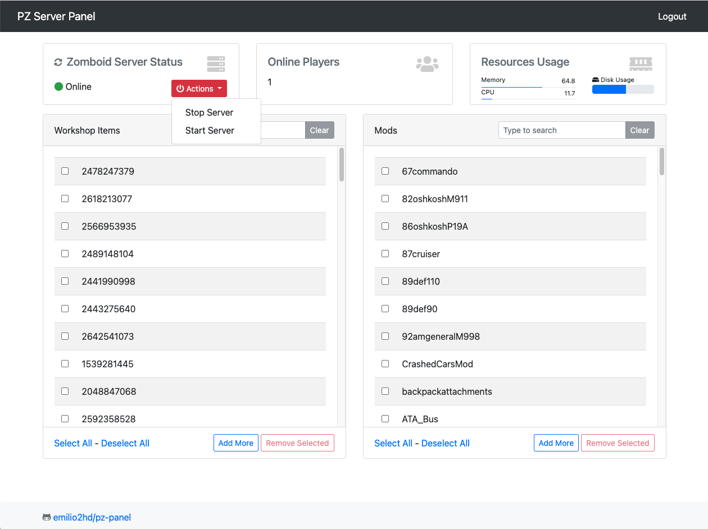

# pz-panel
Project Zomboid Server Panel

This project depends of a server configured by [pz-server](https://github.com/emilio2hd/pz-server).

# Features
* Start and stop Zomboid Dedicated server.
* Add and remove one or multiple Workshop Items and Mods to the server.
* Display number of online users.
* Display server Memory and CPU usage.
* Import workshop items and mod ids from a server config.
* Export all the workshop items and mods currently installed

# Dependencies
* Python 3.9.9
* Poetry 1.1.13